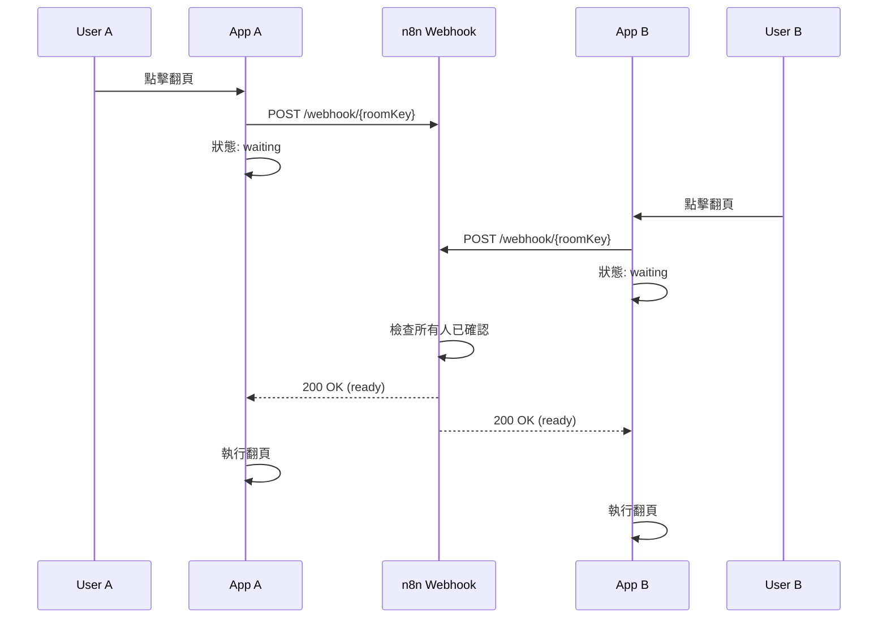

# 📚 EPUB Home - 共享閱讀體驗應用

<div align="center">

**與朋友一起閱讀，同步翻頁，共享體驗**


</div>

## ✨ 功能亮點

### 🎯 核心功能

1. **📖 完整的 EPUB 閱讀器**
   - 支援標準 EPUB 格式
   - HTML 內容完美渲染
   - 章節導航與進度追蹤
   - 流暢的閱讀體驗

2. **👥 多人房間連線**
   - 本地網絡設備自動發現（mDNS）
   - 快速創建/加入閱讀房間
   - 實時參與者狀態顯示
   - 房主權限管理

3. **🔄 同步翻頁機制**
   - 智能等待所有參與者確認
   - Webhook 集成（n8n）實現協調
   - 視覺化等待狀態
   - 一鍵取消翻頁請求

### 🎨 使用場景

**與朋友共同閱讀一本書**
```
1. 房主選擇書籍並創建房間
2. 朋友通過本地網絡加入房間
3. 任何人想翻頁時點擊
4. 系統等待所有人確認
5. 確認完成後，所有設備同步翻頁
6. 享受同步閱讀的樂趣
```

## 🏗️ 技術架構

### 技術棧

| 層次 | 技術選型 | 說明 |
|------|---------|------|
| **UI 框架** | Flutter 3.32.0 | 跨平台移動應用開發 |
| **狀態管理** | Provider + GetIt | 全局狀態管理與依賴注入 |
| **EPUB 解析** | epubx | EPUB 文件解析與內容提取 |
| **HTML 渲染** | flutter_html | 富文本內容顯示 |
| **網絡通信** | Dio + HTTP | RESTful API 與 Webhook |
| **本地發現** | multicast_dns | mDNS 設備發現 |
| **本地存儲** | SharedPreferences + SQLite | 配置與數據持久化 |

### 架構設計

```
┌─────────────────────────────────────┐
│      Presentation Layer             │
│  ┌──────────┬──────────┬─────────┐ │
│  │ Screens  │ Widgets  │Provider │ │
│  └──────────┴──────────┴─────────┘ │
├─────────────────────────────────────┤
│      Business Logic Layer           │
│  ┌──────────┬──────────┬─────────┐ │
│  │  EPUB    │  Room    │  Sync   │ │
│  │ Service  │ Service  │ Service │ │
│  └──────────┴──────────┴─────────┘ │
├─────────────────────────────────────┤
│         Data Layer                  │
│  ┌──────────┬──────────┬─────────┐ │
│  │  Models  │ Storage  │ Network │ │
│  └──────────┴──────────┴─────────┘ │
└─────────────────────────────────────┘
```

### 同步機制



## 🚀 快速開始

### 環境要求

- Flutter SDK: 3.32.0+
- Dart SDK: 3.3+
- Android SDK: API 21+
- Java: 17+

### 安裝步驟

1. **克隆項目**
```bash
git clone <repository-url>
cd epub_home
```

2. **安裝依賴**
```bash
flutter pub get
```

3. **運行應用**
```bash
# 開發模式
flutter run

# 生產模式
flutter run --release
```

4. **構建 APK**
```bash
flutter build apk --release
```

### 配置 n8n Webhook

1. 在 n8n 中創建 Webhook 節點
2. 設置 URL: `https://n8n.lazyrhythm.com/webhook/{roomKey}`
3. 配置邏輯：
   - 接收所有用戶的翻頁請求
   - 追蹤每個房間的確認狀態
   - 當所有人確認後返回 200 OK
   - 未完成時返回 202 Accepted

## 📱 使用指南

### 導入書籍

1. 點擊「書庫」標籤
2. 點擊「導入 EPUB」按鈕
3. 選擇 EPUB 文件
4. 等待解析完成

### 創建房間

1. 點擊「房間」標籤
2. 點擊「創建房間」按鈕
3. 輸入房間名稱
4. 選擇要共享的書籍
5. 點擊「創建」

### 加入房間

1. 確保在同一網絡
2. 等待自動發現
3. 選擇要加入的房間
4. 開始同步閱讀

### 同步閱讀

1. 在閱讀頁面，點擊屏幕右側翻頁
2. 等待其他參與者確認
3. 所有人確認後自動翻頁
4. 可隨時取消翻頁請求

## 📂 項目結構

```
lib/
├── main.dart                 # 應用入口
├── app.dart                  # App 配置
├── models/                   # 數據模型
│   ├── book.dart            # 書籍模型
│   ├── room.dart            # 房間模型
│   └── user.dart            # 用戶模型
├── services/                 # 服務層
│   ├── epub_service.dart    # EPUB 解析
│   ├── room_service.dart    # 房間管理
│   ├── sync_service.dart    # 同步服務
│   ├── storage_service.dart # 本地存儲
│   └── network_service.dart # 網絡服務
├── providers/                # 狀態管理
│   ├── book_provider.dart   # 書籍狀態
│   ├── room_provider.dart   # 房間狀態
│   └── user_provider.dart   # 用戶狀態
├── screens/                  # 畫面
│   ├── home_screen.dart     # 首頁
│   ├── library_screen.dart  # 書庫
│   ├── reader_screen.dart   # 閱讀器
│   └── room_screen.dart     # 房間管理
├── widgets/                  # 自定義組件
│   ├── epub_reader.dart     # EPUB 閱讀器
│   └── page_turn_overlay.dart # 翻頁等待覆蓋層
└── utils/                    # 工具類
    ├── constants.dart       # 常量
    └── di.dart              # 依賴注入
```

## 🔧 核心依賴

```yaml
dependencies:
  # EPUB 解析
  epubx: ^4.0.0
  flutter_html: ^3.0.0-beta.2

  # 網絡
  dio: ^5.4.0
  http: ^1.2.0

  # 本地網絡發現
  multicast_dns: ^0.3.2
  network_info_plus: ^5.0.0

  # 狀態管理
  provider: ^6.1.1
  get_it: ^7.6.7

  # 存儲
  shared_preferences: ^2.2.2
  sqflite: ^2.3.2

  # UI
  file_picker: ^6.1.1
  qr_flutter: ^4.1.0
```

## 🎯 開發計劃

### ✅ 已完成
- [x] EPUB 閱讀器核心功能
- [x] 房間創建與管理
- [x] 本地網絡設備發現
- [x] 同步翻頁機制
- [x] Webhook 集成

### 🚧 進行中
- [ ] 完善 UI/UX 設計
- [ ] 添加單元測試
- [ ] 性能優化

### 📋 未來計劃
- [ ] **外部網絡連線支援**
  - WebSocket 實時通信
  - 雲端房間管理
  - NAT 穿透技術

- [ ] **閱讀功能增強**
  - 書籤管理
  - 筆記與標註
  - 字體大小調整
  - 夜間模式
  - 背景顏色自定義

- [ ] **社交功能**
  - 房間內語音聊天
  - 即時文字訊息
  - 閱讀統計與成就
  - 分享讀書心得

- [ ] **性能優化**
  - 章節預加載
  - 圖片緩存機制
  - 離線閱讀支援
  - 增量更新

## 🤝 貢獻指南

歡迎提交 Issue 和 Pull Request！

1. Fork 項目
2. 創建特性分支 (`git checkout -b feature/AmazingFeature`)
3. 提交更改 (`git commit -m 'Add some AmazingFeature'`)
4. 推送到分支 (`git push origin feature/AmazingFeature`)
5. 開啟 Pull Request

## 📄 許可證

本項目採用 MIT 許可證 - 詳見 [LICENSE](LICENSE) 文件

## 👨‍💻 作者

**LazyRhythm Team**

- GitHub: [@lazyrhythm](https://github.com/lazyrhythm)
- n8n Webhook: https://n8n.lazyrhythm.com

## 🙏 致謝

- Flutter Team - 優秀的跨平台框架
- epubx - EPUB 解析庫
- flutter_html - HTML 渲染支援
- 所有開源貢獻者

---

<div align="center">
Made with ❤️ by LazyRhythm Team
</div>
